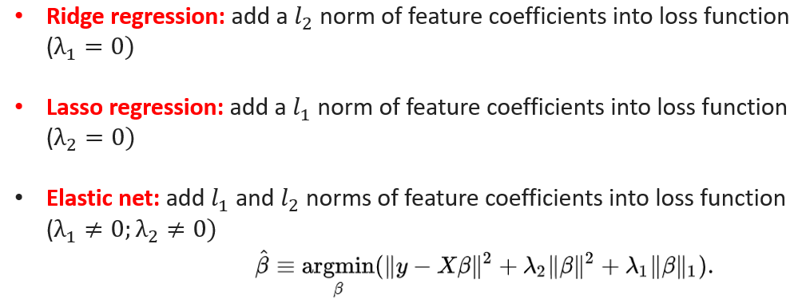
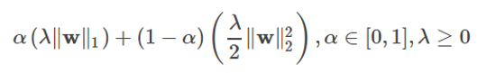
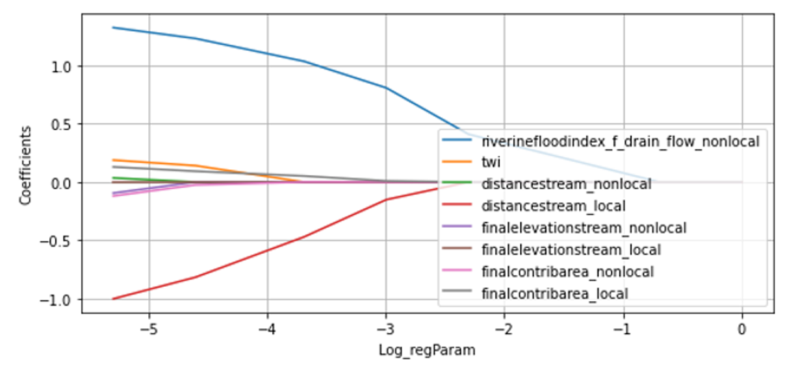
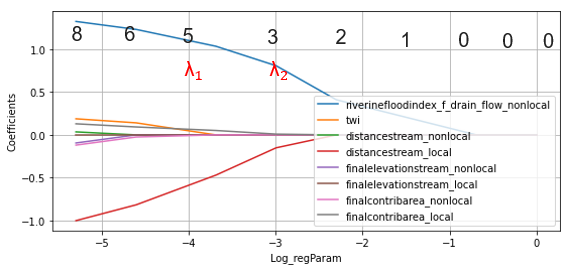
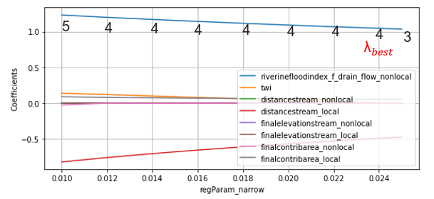
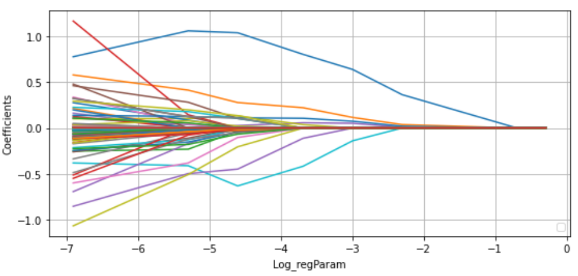
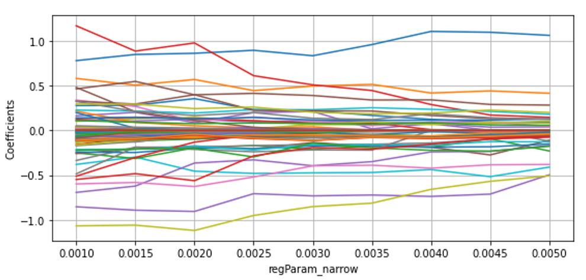

# Feature Selection 
Execute scripts in the src folder for feature selection thorugh a regularization method (elastic-net).

## Benefits of Feature Selection
* Improve model performance: eliminate the multi-collinearities among features and reduce overfitting.

* Reduce training time: less data means training faster.

## Feature selection methods

* Filter methods: fast and easy, model independent, but too simplified. e.g. correlation-test, univariate-test, etc. 

* Wrapper methods: use a predictive model to score feature subsets; model dependent, aiming on specific type of model, computationally-intensive.

* Embedded methods: one of the most popular techniques for feature selection; perform feature selection as part of the model construction process, mostly through regularization (i.e., shrink unimportant feature’s coefficient to zero), e.g., Lasso, elastic net.

Note since our data is very imbalanced (4 million data with 96% labels are false), the calculated F-statistic (F = between-group variance / within-group variance) would be very big for all features, so it is hard to select features based on this test (Filter method). 

## Regularization method
Instead of searching over a discrete set of solutions, regularization methods can achieve feature selections by:
* Starting with the full model (inclduing all possible features)
* Shrink some feature coefficients "exactly" to zero
* Non-zero coefficients are the "selected" features

Source: https://www.coursera.org/learn/ml-regression/lecture/0FyEi/can-we-use-regularization-for-feature-selection

The popular regularization methods includes:

Figure 1: An image visualising how ordinary regression compares to the Lasso, the Ridge and the Elastic Net Regressors. Image Citation: Zou, H., & Hastie, T. (2005). Regularization and variable selection via the elastic net.

## Peoperties of regularization methods
* Ridge regression: Allocates weights equally among correlated features. Not good for feature selection, but solutions are stable.

* Lasso regression: Randomly select one feature among many correlated features, good for feature selection, but the solutions are relatively unstable.

* Elastic net: Overcomes the disadvantages of ridge and lasso. The only need is to select the number of features desired. We will select this method in our script

## Trace method to select top N features:

There are two parameters in the penalty term of elastic net: λ and ɑ

* ɑ only controls if the elastic net is more like Lasso or ridge, ɑ=1 Lasso, ɑ=0 ridge, 0<ɑ<1, elastic net. We can fix this parameter to 0.8.

* Trace plot: a plot of estimated coefficients against a shrinkage parameter λ. A big λ will shrink all features coefficients to zero; λ=0 is equivalent to OLS.

Using riverine model as an example, the trace plot on the original 8 features is:

We just need to find a λ (regParam), under which we have exactly top N  features coefficients are non-zero. The following are the workflows for both scripts. Note that they only differ in whether use ploynomial expansion on original faetures before selection or not.

# feature_selection_final.py workflow:

1. Standardize each feature: very important for feature selection methods  based on regularization. Note that the features are original features, e.g., we have 8 for riverine model.

2. Fix ɑ = 0.8 (more Lasso than ridge), make an elastic-net trace plot based on a wide range of λ:

3. Find “top N" (e.g., 4) is between which two λ values’ ($λ_1$, $λ_2$) corresponding non-zero feature coefficients

4.  Narrow the range of λ to ($λ_1$, $λ_2$) : re-create the range of λ  using np.linspace between ($λ_1$, $λ_2$) 

5.  Under the same ɑ, make a new elastic-net trace plot based on the linspace between ($λ_1$, $λ_2$):

6. Find which λ value corresponds to 4 non-zero feature coefficients, note as $λ_{best}$. If multiple $λ_{best}$, pick the last one.

7.  If $λ_{best}$ exists, find its corresponding non-zero coefficients, print those features as the features selected

8. If $λ_{best}$ does not exist, find the nearest number of non-zero coefficient to the top N (e.g., non-zeros number might be 8,6,4,2,0; If top N is 3, then we pick 4 (2 is also OK but we pick the first cloestest one). Warn users that we are not picking exactly top N but an closest number. Return the selected features' names

# feature_selection_ployExpan.py workflow:

1. Conduct ploynomial expansion on the original features: e.g., if we have 8 original features, after a 3-degree ployExpan, the total features would be 167. https://stackoverflow.com/questions/65455944/how-to-get-the-feature-names-from-polynomialexpansion-in-pyspark-2-4-0 describes how the ployExpan works. Standardize the expanded features.

2. steps 2-7 are same with above.

* The trace plot on the 167 expanded features:

* The narrowed trace plot 

3. If $λ_{best}$ does not exist (very common in this case)
, find the nearest number of non-zero coefficient to the top N.  Warn users that we are not picking exactly top N but an closest number. Instead of return selected features name (we do not have such names after expansion), we return the non-zero coefficient index, which can be feeded into the later training process.

# Remarks:
* The feature selection is conducted only based on the training data, which should be the same with the training data used in the training process. We ensure this by using the same seed.

* If feature_selection_ployExpan.py is used, then do not use ployExpan again in the following training process. Instead, directly use the selected features to train the model.

* If feature_selection_ployExpan.py is used, do not add ploynomial degree for the cross-validation grid search in the trainging model.

